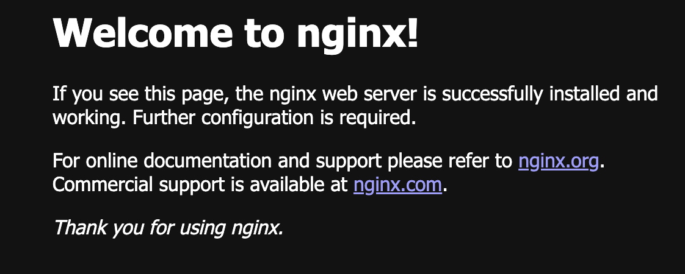

### nginx を利用した minikube の動作検証

web ブラウザから nodeport を介して service にアクセスした際に以下のように表示されることまで確認する。



### 1. deployment と service を作成する

以下のコマンドを実行し、kubernetes（minikube）上に service を deploy する。

```bash
$ kubectl apply -f manifest/sample-nginx/sample-nginx-deployment.yaml
$ kubectl apply -f manifest/sample-nginx/sample-nginx-service.yaml
```

pod が生成されていることを確認する

```bash
$ kubectl get services
NAME           TYPE        CLUSTER-IP     EXTERNAL-IP   PORT(S)        AGE
kubernetes     ClusterIP   10.96.0.1      <none>        443/TCP        6h36m
sample-nginx   NodePort    10.105.79.65   <none>        80:32212/TCP   13m
```

docker を engin として minikube を起動している場合、NodePort はそのままでは使えない。つまり上記のような状況で`localhost:32212`へアクセスしても Nginx へはアクセスができない。tunnel を設定してあげる必要があるので、以下のコマンドを実行する。

```bash
$ minikube service sample-nginx --url
http://127.0.0.1:50076
❗  Docker ドライバーを darwin 上で使用しているため、実行するにはターミナルを開く必要があります。

```

※ VM を engine として minikube 環境を構築している場合は必要ない。

コマンドを実行し得られた URL（上記の例だと`http://127.0.0.1:50076`へアクセスすると nginx の初期画面が描画されるはず）
